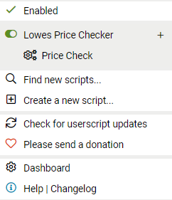
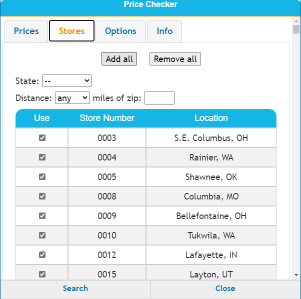
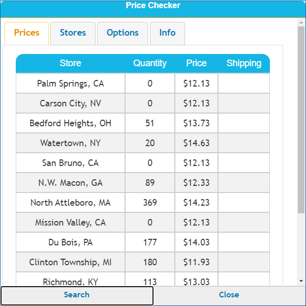

# LowesPriceChecker-2020

Updated version of a Lowes price checker tool. If this update helped you or find it useful, please consider donating to me. The donate button is in the tool.

## Installation

User scripts have to be enabled in your browser. Then install the extension Tampermonkey.

  For Chrome:   [Tampermonkey](https://www.tampermonkey.net/?ext=dhdg&browser=chrome)

  For Firefox:  [Tampermonkey](https://www.tampermonkey.net/?ext=dhdg&browser=firefox)

Then the script:

  Price Checking Script. [Click to Install](https://github.com/JamoDevOne/LowesPriceChecker2020/raw/master/PriceChecker2020.user.js)
  
## Instructions

1. Open the Tampermonkey extension in your browser and select the price check script.

    
    
2. A dialog of the tool will open. Then click on the stores tabs and select all.
  
  
  
3. Then go to the options tab and choose the configuration you want.

  

4. Switch over to the prices tabs and click search. The prices will show up in a moment.

  
  

  

